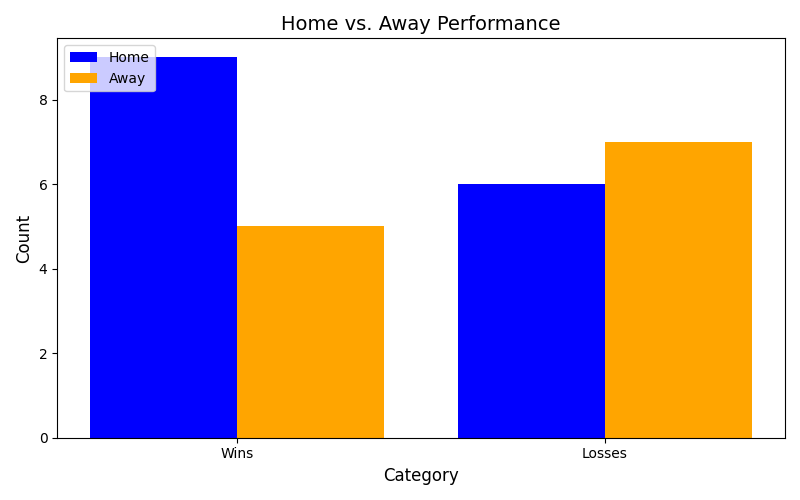
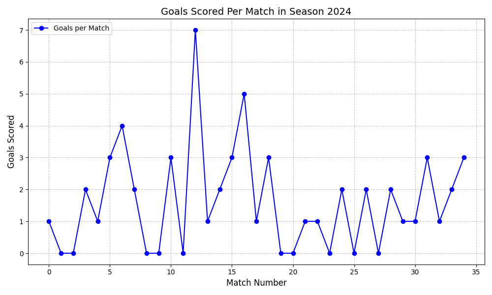

# Premier League Data Analysis

## Overview
This project fetches and analyzes Premier League match data for the 2024 season using the API-Football API. The application stores data in a MongoDB database and generates insightful visualizations, such as trends of goals scored and home vs. away performance.

## Features
- Fetch and store Premier League match fixtures and statistics for the 2024 season.
- Analyze team performance, including wins and losses for home and away matches.
- Plot trends in goals scored throughout the season.
- Compare home vs. away performance visually.

---

## Prerequisites
Before running this project, ensure you have the following installed:

- Python 3.8+
- MongoDB (either local or cloud-based, e.g., MongoDB Atlas)
- A valid API-Football API key from RapidAPI
- Required Python libraries:
  - `pymongo`
  - `requests`
  - `matplotlib`
  - `python-dotenv`

---

## Installation

### Step 1: Clone the Repository

```bash
git clone https://github.com/your-username/premier-league-analysis.git
cd premier-league-analysis
```
### Step 2: Install Python Dependencies
```bash
Copy code
pip install -r requirements.txt
```

### Step 3: Set Up Environment Variables
1. Create a .env file in the project root directory.
2. Add your API-Football API key:
```bash
API_KEY=your_api_key_here
```
---

## Usage

### Step 1: Run the Project
To start the project, execute the main script:
```bash
python main.py
```
### Step 2: Populate the Database
You will be prompted to populate the database with Premier League fixtures and statistics:
```bash
Do you want to populate the database? (yes/no): yes
```
### Step 3: Analyze Team Performance
Enter the team name to analyze:
```bash
Enter the team name: Manchester United
```
The application will display performance statistics and generate visualizations for:
- Goals scored trend during the season.
- Comparison of home vs. away performance.

---

## Functionality
### 1. Database Population
The <mark>populate_database</mark> function:
- Fetches Premier League teams and fixtures for the 2024 season using the API.
- Stores the data in a MongoDB database.

### 2. Team Performance Analysis
The <mark>getMatches</mark> function:
- Analyzes a team's performance based on wins and losses for home and away matches.

### 3. Goals Trend Visualization
The <mark>plot_goals_trend</mark> function:
- Visualizes goals scored by the team in each match of the 2024 season.

### 4. Home vs. Away Performance Comparison
The <mark>plot_home_away_performance</mark> function:
- Creates a bar chart comparing the number of wins and losses at home and away.

---

## File Descriptions
### 1. <mark>main.py</mark>
Handles the main workflow of the project, including database interactions and analysis.
### 2. <mark>etl_pipeline.py</mark>
Handles data fetching and database population:
- Fetches teams, fixtures, and statistics from the API.
- Inserts or updates MongoDB with fetched data.
### 3. <mark>analysis.py</mark>
Contains analysis and visualization functions:
- Builds MongoDB aggregation pipelines for analyzing team performance.
- Generates plots for goals trends and home vs. away performance.

---

## Example Output

### Console Output
```bash
Starting Project
Do you want to populate the database? (yes/no): yes
Data for team Manchester United successfully updated.
Enter the team name: Manchester United
Team Performance Statistics:
Wins Home: 10
Wins Away: 7
Losses Home: 3
Losses Away: 5
```
## Graphs

### Home vs. Away Performance
This graph compares the number of wins and losses at home and away:



---

### Goals Scored Trend
This graph shows the trend of goals scored by the team during the season:



---

## License
This project is licensed under the MIT License.